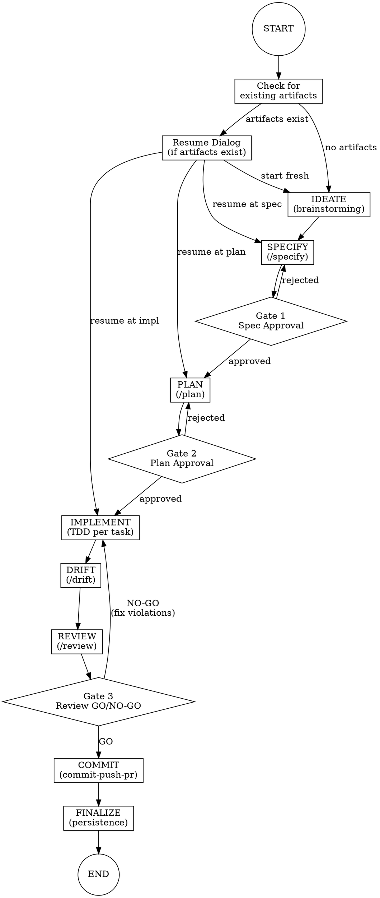

# /sdd-flow - Full Lifecycle Orchestrator

## Overview

**Orchestrate the complete SDD lifecycle: idea → spec → plan → TDD implementation → review → PR.**

This skill chains together the SDD workflow commands with human-in-the-loop gates and strict TDD during implementation.

## Announcement

When invoked, announce:
```
Starting SDD Flow for [feature-name]...

This orchestrates: IDEATE → SPECIFY → [Gate 1] → PLAN → [Gate 2] → IMPLEMENT (TDD) → DRIFT → REVIEW → [Gate 3] → COMMIT

You'll have 3 approval gates where I'll stop and wait for your explicit approval.
```

## State Machine



---

## Phase 1: Resume Check

**Before starting any phase, check for existing artifacts.**

### Check Logic

```
1. Check if memory/specs/<feature-name>.md exists
2. Check if memory/plans/<feature-name>/plan.md exists
3. Check spec/plan Status field (Draft, Review, Approved)
```

### Resume Dialog

If artifacts exist, present options:

```
I found existing artifacts for [feature-name]:

📋 Spec: memory/specs/[feature-name].md (Status: [status])
📝 Plan: memory/plans/[feature-name]/plan.md (Status: [status])

How would you like to proceed?
1. Start fresh (archive existing artifacts)
2. Resume from spec (edit and re-approve)
3. Resume from plan (edit and re-approve)
4. Resume implementation (continue from plan)
```

**Validation before resuming:**
- If spec status is "Draft", cannot resume past SPECIFY
- If plan status is "Draft", cannot resume past PLAN
- If plan status is "Approved", can resume at IMPLEMENT

---

## Phase 2: Ideate (Brainstorming)

**Goal:** Explore the feature idea before formalizing.

**Process:**
1. Invoke `superpowers:brainstorming` skill mindset
2. Ask discovery questions:
   - What problem does this solve?
   - Who is the user?
   - What's the minimal viable version?
   - What's explicitly out of scope?
3. Synthesize understanding before proceeding to SPECIFY

**Output:** Clear understanding, ready to write spec

---

## Phase 3: Specify

**Goal:** Create a formal specification.

**Process:**
1. Execute `/specify <feature-name>` logic inline:
   - Ask 2-5 clarifying questions
   - Generate PRD at `memory/specs/<feature-name>.md`
   - Include: Problem, Solution, Acceptance Criteria, Out of Scope
2. Present spec summary to user

**Output:** `memory/specs/<feature-name>.md` with Status: Review

---

## Gate 1: Spec Approval

**HARD GATE - Cannot proceed until resolved.**

### Protocol

Present the spec and ask:

```
╔═══════════════════════════════════════════════════════════════╗
║  GATE 1: SPECIFICATION APPROVAL                                ║
╠═══════════════════════════════════════════════════════════════╣
║                                                                ║
║  Spec: memory/specs/[feature-name].md                          ║
║                                                                ║
║  Summary:                                                      ║
║  - Problem: [1-line summary]                                   ║
║  - Solution: [1-line summary]                                  ║
║  - Acceptance Criteria: [count] items                          ║
║                                                                ║
║  Do you APPROVE this specification?                            ║
║  (Type "approve", "approved", or "yes" to proceed)             ║
║                                                                ║
╚═══════════════════════════════════════════════════════════════╝
```

### Response Handling

| User Response | Action |
|---------------|--------|
| "approve", "approved", "yes", "lgtm" | Update spec Status to "Approved", proceed to PLAN |
| Feedback or concerns | Collect feedback, loop back to SPECIFY |
| "cancel", "stop" | Exit flow gracefully |

### On Rejection

```
Got it. Let me revise the specification based on your feedback.

Your concerns:
- [listed concerns]

Returning to SPECIFY phase...
```

---

## Phase 4: Plan

**Goal:** Create implementation plan from approved spec.

**Process:**
1. Invoke `superpowers:writing-plans` mindset for structure
2. Execute `/plan <feature-name>` logic inline:
   - Read approved spec
   - Analyze codebase for relevant files/patterns
   - Generate plan at `memory/plans/<feature-name>/plan.md`
   - Include: Phases, Files, Tasks, Testing Approach, Risks
3. Present plan overview to user

**Output:** `memory/plans/<feature-name>/plan.md` with Status: Draft

---

## Gate 2: Plan Approval

**HARD GATE - Per Constitution Article II, non-negotiable.**

### Protocol

Present the plan and ask:

```
╔═══════════════════════════════════════════════════════════════╗
║  GATE 2: PLAN APPROVAL (Article II)                            ║
╠═══════════════════════════════════════════════════════════════╣
║                                                                ║
║  Plan: memory/plans/[feature-name]/plan.md                     ║
║                                                                ║
║  Overview:                                                     ║
║  - Phases: [count]                                             ║
║  - Files to create: [count]                                    ║
║  - Files to modify: [count]                                    ║
║  - Testing: [approach summary]                                 ║
║                                                                ║
║  Per Constitution Article II, this plan requires your          ║
║  EXPLICIT APPROVAL before implementation can begin.            ║
║                                                                ║
║  Do you APPROVE this implementation plan?                      ║
║  (Type "approve", "approved", or "yes" to proceed)             ║
║                                                                ║
╚═══════════════════════════════════════════════════════════════╝
```

### Response Handling

Same as Gate 1, but on approval:
- Update plan Status to "Approved"
- Proceed to IMPLEMENT

---

## Phase 5: Implement (TDD)

**Goal:** Implement the plan using strict Test-Driven Development.

### Iron Law

```
NO PRODUCTION CODE WITHOUT A FAILING TEST FIRST
```

### Per-Task TDD Cycle

For each task in the plan:

```
┌─────────────────────────────────────────────────────┐
│ Task: [task description]                            │
├─────────────────────────────────────────────────────┤
│                                                     │
│ 1. RED: Write test that captures the requirement   │
│    → Run test → MUST FAIL (proves test works)      │
│                                                     │
│ 2. GREEN: Write MINIMAL code to pass the test      │
│    → Run test → MUST PASS                          │
│                                                     │
│ 3. REFACTOR: Clean up while keeping tests green    │
│    → Run tests → MUST STILL PASS                   │
│                                                     │
└─────────────────────────────────────────────────────┘
```

### TDD Process

1. **Invoke** `superpowers:test-driven-development` mindset
2. **For each plan task:**
   - Announce: "Starting TDD cycle for: [task]"
   - Write test first (describe expected behavior)
   - Run test, confirm RED (failure)
   - Write minimal implementation
   - Run test, confirm GREEN (pass)
   - Refactor if needed, confirm still GREEN
   - Mark task complete in plan
3. **Track violations** for later learnings

### TDD Violations to Track

| Violation | What Happened |
|-----------|---------------|
| Code before test | Wrote implementation before test |
| Test didn't fail | Test passed immediately (not testing new behavior) |
| Over-implementation | Wrote more than minimal code to pass |

These are tracked but don't block - they inform the FINALIZE phase.

---

## Phase 6: Drift Check

**Goal:** Verify implementation matches specification.

**Process:**
1. Execute `/drift <feature-name>` logic
2. For each acceptance criterion in spec:
   - Search codebase for implementation evidence
   - Mark: ✅ (implemented), ❌ (missing), ⚠️ (divergent)
3. Report results

**Output:** Drift report showing spec alignment

### Drift Results

| Result | Meaning | Action |
|--------|---------|--------|
| All ✅ | Perfect alignment | Proceed to REVIEW |
| Any ❌ | Missing implementation | Return to IMPLEMENT for missing items |
| Any ⚠️ | Divergence | Decide: fix code or update spec |

---

## Phase 7: Review

**Goal:** Constitutional compliance check.

**Process:**
1. Execute `/review <feature-name>` logic inline
2. Check all 6 constitutional articles
3. Render GO or NO-GO decision

**Output:** Constitutional review decision

---

## Gate 3: Review Decision

**HARD GATE - Must resolve violations before commit.**

### On GO Decision

```
╔═══════════════════════════════════════════════════════════════╗
║  GATE 3: CONSTITUTIONAL REVIEW                                 ║
╠═══════════════════════════════════════════════════════════════╣
║                                                                ║
║  ✅ REVIEW: GO                                                 ║
║                                                                ║
║  All articles satisfied. Ready to commit.                      ║
║                                                                ║
║  Proceed to COMMIT phase?                                      ║
║  (Type "yes" to continue, or "wait" to pause)                  ║
║                                                                ║
╚═══════════════════════════════════════════════════════════════╝
```

### On NO-GO Decision

```
╔═══════════════════════════════════════════════════════════════╗
║  GATE 3: CONSTITUTIONAL REVIEW                                 ║
╠═══════════════════════════════════════════════════════════════╣
║                                                                ║
║  ❌ REVIEW: NO-GO                                              ║
║                                                                ║
║  Violations found:                                             ║
║  - Article [N]: [issue] → Fix: [resolution]                    ║
║  - Article [M]: [issue] → Fix: [resolution]                    ║
║                                                                ║
║  Returning to IMPLEMENT to address violations...               ║
║                                                                ║
╚═══════════════════════════════════════════════════════════════╝
```

### Violation Mapping

Map each violation to a fix action:

| Article | Typical Fix |
|---------|-------------|
| I (Spec) | Update spec or fix code to match |
| II (Plan) | Document deviation or revert |
| IV (Docs) | Add missing documentation |
| V (YAGNI) | Remove over-engineering |
| VI (Clarity) | Improve naming/comments |

---

## Phase 8: Commit

**Goal:** Create commit, push, and open PR.

**Process:**
1. Invoke `commit-commands:commit-push-pr` skill
2. Auto-generate commit message from:
   - Feature name
   - Spec summary
   - Key changes
3. Push to remote
4. Create PR with:
   - Link to spec
   - Link to plan
   - Summary of implementation

**Output:** PR URL

---

## Phase 9: Finalize (Persistence)

**Goal:** Optionally persist learnings.

### Persistence Dialog

```
╔═══════════════════════════════════════════════════════════════╗
║  SDD FLOW COMPLETE                                             ║
╠═══════════════════════════════════════════════════════════════╣
║                                                                ║
║  Feature: [feature-name]                                       ║
║  PR: [PR URL]                                                  ║
║                                                                ║
║  Would you like to persist any learnings?                      ║
║                                                                ║
║  1. Create hookify rules from patterns/violations              ║
║  2. Save learnings to Serena memory                            ║
║  3. Both                                                       ║
║  4. Skip (done)                                                ║
║                                                                ║
╚═══════════════════════════════════════════════════════════════╝
```

### Option 1: Hookify Rules

If TDD violations or review issues occurred, offer to create hooks:

```
Detected patterns that could benefit from hooks:

- [Pattern]: [description]
  Suggested hook: [hook description]

Create these hooks? (yes/no)
```

Invoke `hookify:hookify` with the patterns.

### Option 2: Serena Memory

Persist learnings to `sdd-flow-learnings.md`:

```markdown
# SDD Flow Learnings

## [feature-name] - [date]

### What Worked
- [observation]

### What Didn't
- [observation]

### Patterns Discovered
- [pattern]
```

Use `write_memory` or `edit_memory` to persist.

---

## Error Handling

### Spec Not Found (in PLAN phase)

```
Error: No specification found at memory/specs/[feature-name].md

Cannot create plan without approved spec (Article I).
Returning to SPECIFY phase...
```

### Plan Not Found (in IMPLEMENT phase)

```
Error: No plan found at memory/plans/[feature-name]/plan.md

Cannot implement without approved plan (Article II).
Returning to PLAN phase...
```

### Test Failures During TDD

```
Test failure detected during TDD cycle.

Current task: [task]
Failing test: [test name]
Error: [error message]

This is expected in RED phase, unexpected in GREEN/REFACTOR.

Continue debugging? (yes/skip task/abort)
```

### User Interruption

At any point, if user says "stop", "cancel", or "pause":

```
SDD Flow paused at [current phase].

Your progress is saved:
- Spec: [status]
- Plan: [status]

Resume later with: /sdd-flow [feature-name]
```

---

## Integration Points

| Phase | External Skill | Purpose |
|-------|----------------|---------|
| IDEATE | `superpowers:brainstorming` | Explore requirements |
| PLAN | `superpowers:writing-plans` | Structure plan |
| IMPLEMENT | `superpowers:test-driven-development` | TDD discipline |
| IMPLEMENT | `superpowers:verification-before-completion` | Verify before claiming done |
| COMMIT | `commit-commands:commit-push-pr` | Git workflow |
| FINALIZE | `hookify:hookify` | Create prevention hooks |
| FINALIZE | Serena `write_memory` | Persist learnings |

---

## Quick Reference

| Phase | Gate | Output | Next |
|-------|------|--------|------|
| IDEATE | - | Understanding | SPECIFY |
| SPECIFY | Gate 1 | Spec (Review) | PLAN |
| PLAN | Gate 2 | Plan (Approved) | IMPLEMENT |
| IMPLEMENT | - | Code + Tests | DRIFT |
| DRIFT | - | Alignment report | REVIEW |
| REVIEW | Gate 3 | GO/NO-GO | COMMIT |
| COMMIT | - | PR URL | FINALIZE |
| FINALIZE | - | Learnings | END |

---

## Constitution Compliance

This skill enforces all six constitutional articles:

| Article | Enforcement |
|---------|-------------|
| I: Spec-First | SPECIFY phase + Gate 1 |
| II: Human-in-the-Loop | Gate 2 (mandatory) |
| III: Constitutional Review | REVIEW phase + Gate 3 |
| IV: Documentation | /document suggestion at FINALIZE |
| V: Progressive Enhancement | Brainstorming + TDD minimalism |
| VI: Clear Communication | Phase announcements + Gate dialogs |
