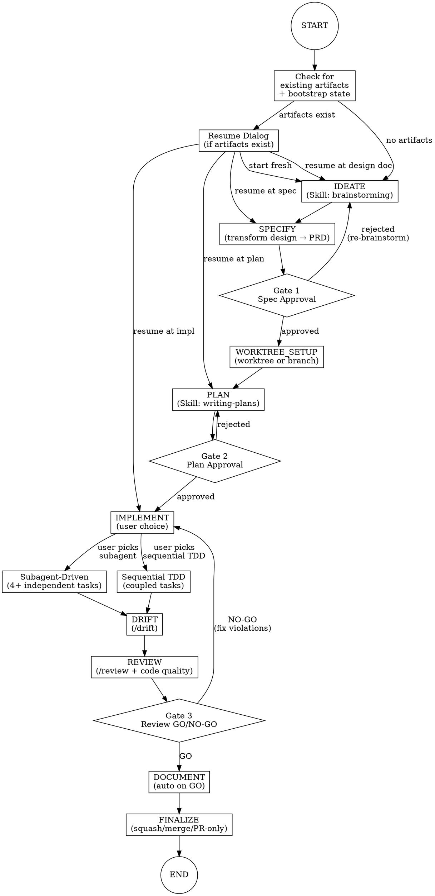

# /sdd-flow - Full Lifecycle Orchestrator

## Overview

**Orchestrate the complete SDD lifecycle: idea → spec → plan → TDD implementation → review → PR.**

This skill chains together the SDD workflow commands with human-in-the-loop gates, strict TDD during implementation, superpowers integration for worktrees/subagent execution/branch finalization, and an automatic documentation lifecycle that maintains spec versioning, a feature registry, and lightweight ADRs.

## Announcement

When invoked, announce:
```
Starting SDD Flow for [feature-name]...

This orchestrates: IDEATE → SPECIFY → [Gate 1] → WORKTREE → PLAN → [Gate 2] → IMPLEMENT → DRIFT → REVIEW → [Gate 3] → DOCUMENT → FINALIZE

You'll have 3 approval gates where I'll stop and wait for your explicit approval.
```

## State Machine


```dot
digraph sdd_flow {
    rankdir=TB;
    node [shape=box];

    START [shape=circle, label="START"];
    RESUME_CHECK [label="Check for\nexisting artifacts\n+ bootstrap state"];
    RESUME_DIALOG [label="Resume Dialog\n(if artifacts exist)"];
    IDEATE [label="IDEATE\n(Skill: brainstorming)"];
    SPECIFY [label="SPECIFY\n(transform design → PRD)"];
    GATE1 [shape=diamond, label="Gate 1\nSpec Approval"];
    WORKTREE_SETUP [label="WORKTREE_SETUP\n(worktree or branch)"];
    PLAN [label="PLAN\n(Skill: writing-plans)"];
    GATE2 [shape=diamond, label="Gate 2\nPlan Approval"];
    IMPLEMENT [label="IMPLEMENT\n(user choice)"];
    IMPLEMENT_SUBAGENT [label="Subagent-Driven\n(4+ independent tasks)"];
    IMPLEMENT_TDD [label="Sequential TDD\n(coupled tasks)"];
    DRIFT [label="DRIFT\n(/drift)"];
    REVIEW [label="REVIEW\n(/review + code quality)"];
    GATE3 [shape=diamond, label="Gate 3\nReview GO/NO-GO"];
    DOCUMENT [label="DOCUMENT\n(auto on GO)"];
    FINALIZE [label="FINALIZE\n(squash/merge/PR-only)"];
    END [shape=circle, label="END"];

    START -> RESUME_CHECK;
    RESUME_CHECK -> RESUME_DIALOG [label="artifacts exist"];
    RESUME_CHECK -> IDEATE [label="no artifacts"];
    RESUME_DIALOG -> IDEATE [label="start fresh"];
    RESUME_DIALOG -> IDEATE [label="resume at design doc"];
    RESUME_DIALOG -> SPECIFY [label="resume at spec"];
    RESUME_DIALOG -> PLAN [label="resume at plan"];
    RESUME_DIALOG -> IMPLEMENT [label="resume at impl"];
    IDEATE -> SPECIFY;
    SPECIFY -> GATE1;
    GATE1 -> WORKTREE_SETUP [label="approved"];
    GATE1 -> IDEATE [label="rejected\n(re-brainstorm)"];
    WORKTREE_SETUP -> PLAN;
    PLAN -> GATE2;
    GATE2 -> IMPLEMENT [label="approved"];
    GATE2 -> PLAN [label="rejected"];
    IMPLEMENT -> IMPLEMENT_SUBAGENT [label="user picks\nsubagent"];
    IMPLEMENT -> IMPLEMENT_TDD [label="user picks\nsequential TDD"];
    IMPLEMENT_SUBAGENT -> DRIFT;
    IMPLEMENT_TDD -> DRIFT;
    DRIFT -> REVIEW;
    REVIEW -> GATE3;
    GATE3 -> DOCUMENT [label="GO"];
    GATE3 -> IMPLEMENT [label="NO-GO\n(fix violations)"];
    DOCUMENT -> FINALIZE;
    FINALIZE -> END;
}
```

---

## Phase 1: Resume Check

**Before starting any phase, check for existing artifacts.**

### Check Logic

```
1. Check if docs/superpowers/specs/*-<feature-name>-design.md exists (design doc)
2. Check if memory/specs/<feature-name>.md exists (SDD spec/PRD)
3. Check if memory/plans/<feature-name>/plan.md exists
4. Check spec/plan Status field (Draft, Review, Approved)
5. Check memory/.bootstrap-state.json for bootstrapped specs
```

If `.bootstrap-state.json` exists and contains a module matching `<feature-name>` with status `complete`, treat it as a bootstrapped spec available for resumption.

### Resume Dialog

If artifacts exist, present options:

```
I found existing artifacts for [feature-name]:

Design doc: docs/superpowers/specs/[date]-[feature-name]-design.md (if exists)
Spec: memory/specs/[feature-name].md (Status: [status])
Plan: memory/plans/[feature-name]/plan.md (Status: [status])

How would you like to proceed?
1. Start fresh (archive existing artifacts)
2. Resume from design doc (re-brainstorm and revise)
3. Resume from spec (re-transform design → PRD)
4. Resume from plan (edit and re-approve)
5. Resume implementation (continue from plan)
```

**Validation before resuming:**
- If design doc exists but no PRD in `memory/specs/`, resume at SPECIFY
- If spec status is "Draft", cannot resume past SPECIFY
- If plan status is "Draft", cannot resume past PLAN
- If plan status is "Approved", can resume at IMPLEMENT
- If spec was bootstrapped (Source: Reverse-engineered), note this and offer to refine before proceeding

---

## Phase 2: Ideate (Brainstorming)

**Goal:** Explore the feature idea through superpowers' structured design process.

### MANDATORY Skill Invocation

**STOP. You MUST call `Skill("superpowers:brainstorming")` now.**

Do NOT ask clarifying questions yourself. Do NOT write a design doc yourself. Do NOT write
a spec/PRD yourself. Do NOT skip this step. The brainstorming skill has its own structured
process (Q&A, approaches, design sections, review loop) that MUST run. It produces a
**design doc** (not the SDD spec — that comes in the SPECIFY phase).

### Interception Override

When brainstorming reaches its terminal state ("invoke writing-plans"), do NOT invoke
writing-plans. Instead, return to sdd-flow — the SPECIFY phase comes next, then Gate 1,
then worktree setup, and ONLY THEN does planning happen.

### After Brainstorming Completes

Brainstorming will have written a design doc (typically to `docs/superpowers/specs/`).
Note the path — you will need it in the SPECIFY phase.

Proceed to SPECIFY.

---

## Phase 3: Specify (Transform Design → PRD)

**Goal:** Transform the brainstorming design doc into SDD's governance-ready PRD format.

**Process:**
1. Read the design doc written by brainstorming
2. Create `memory/specs/<feature-name>.md` by extracting and reformatting:
   - **Problem Statement** ← from the design doc's context/exploration
   - **Proposed Solution** ← from the chosen approach
   - **Acceptance Criteria** ← derived from the design's requirements (as checkboxes)
   - **Technical Approach** ← from the design's architecture section
   - **Out of Scope** ← from scope decisions made during brainstorming
   - **Open Questions** ← any unresolved items
   - **Status:** Review
   - **Changelog:** `v1 | [date] | Initial spec | Derived from design doc`
   - **Design Doc:** `[path to design doc]` (link back)
3. Create/update `memory/FEATURES.md` entry with status `drafting`:
   ```
   | [feature-name] | drafting | specs/[feature-name].md | - | - | [date] |
   ```
   If `memory/FEATURES.md` does not exist, create it with:
   ```
   # Feature Registry
   | Feature | Status | Spec | Plan | PR | Date |
   |---------|--------|------|------|----|------|
   ```
4. Present PRD summary to user
5. Proceed to Gate 1

**This phase does NOT ask new questions.** All the hard thinking happened in brainstorming.
This is a transformation step — reshaping the design into SDD's governance format.

**Output:** `memory/specs/<feature-name>.md` (SDD PRD format, Status: Review) + FEATURES.md entry

---

## Gate 1: Spec Approval

**HARD GATE - Cannot proceed until resolved.**

### Protocol

Present the spec and ask:

```
+---------------------------------------------------------------+
|  GATE 1: SPECIFICATION APPROVAL                               |
+---------------------------------------------------------------+
|                                                               |
|  Spec: memory/specs/[feature-name].md                         |
|                                                               |
|  Summary:                                                     |
|  - Problem: [1-line summary]                                  |
|  - Solution: [1-line summary]                                 |
|  - Acceptance Criteria: [count] items                         |
|                                                               |
|  Do you APPROVE this specification?                           |
|  (Type "approve", "approved", or "yes" to proceed)            |
|                                                               |
+---------------------------------------------------------------+
```

### Response Handling

| User Response | Action |
|---------------|--------|
| "approve", "approved", "yes", "lgtm" | Update spec Status to "Approved", proceed to WORKTREE_SETUP |
| Feedback or concerns | Collect feedback, loop back to IDEATE |
| "cancel", "stop" | Exit flow gracefully |

### On Rejection

```
Got it. Let me revise the specification based on your feedback.

Your concerns:
- [listed concerns]

Returning to IDEATE phase...
```

Bump the changelog version with the feedback reason:

```markdown
| v2 | [date] | [summary of changes] | Gate 1 feedback: [reason] |
```

---

## Phase 4: Worktree Setup

**Goal:** Isolate feature work in a dedicated worktree or branch.

**Process:**
1. Offer the user a choice:

```
How would you like to isolate this work?

1. Git worktree (recommended) -- creates feature/[feature-name] in a separate directory
2. Current branch -- stay on current branch, create feature/[feature-name] branch here

Worktrees keep your main working directory clean and let you switch context easily.
```

2. If worktree selected:
   - Invoke `superpowers:using-git-worktrees` skill
   - Create worktree: `git worktree add ../[project]-[feature-name] -b feature/[feature-name]`
   - Change working context to the new worktree directory
   - Announce the worktree path

3. If current branch selected:
   - Create and checkout: `git checkout -b feature/[feature-name]`

4. Record the choice for FINALIZE phase (worktree path or branch-only)

**Output:** Isolated branch `feature/[feature-name]` ready for development

---

## Phase 5: Plan

**Goal:** Create a detailed implementation plan from the approved spec.

### MANDATORY Skill Invocation

**STOP. You MUST call `Skill("superpowers:writing-plans")` now.**

Do NOT write a plan yourself. Do NOT create task lists yourself. Do NOT skip this step.
The writing-plans skill has its own structured process (file structure mapping, bite-sized
TDD tasks with code, plan review loop) that MUST run.

Point writing-plans to both inputs:
- The SDD spec at `memory/specs/<feature-name>.md` (for acceptance criteria)
- The design doc at `docs/superpowers/specs/YYYY-MM-DD-<feature-name>-design.md` (for architecture)

### Interception Override

When writing-plans reaches its terminal state ("Ready to execute?"), do NOT invoke
subagent-driven-development or executing-plans. Instead, return to sdd-flow — Gate 2
comes next.

### After Writing-Plans Completes

1. Copy the plan to `memory/plans/<feature-name>/plan.md` so `/drift` and `/review` can
   find it
2. Update `memory/FEATURES.md` entry to status `planned`
3. Proceed to Gate 2

**Output:** `memory/plans/<feature-name>/plan.md` (superpowers format with execution header)

---

## Gate 2: Plan Approval

**HARD GATE - Per Constitution Article II, non-negotiable.**

### Protocol

Present the plan and ask:

```
+---------------------------------------------------------------+
|  GATE 2: PLAN APPROVAL (Article II)                           |
+---------------------------------------------------------------+
|                                                               |
|  Plan: memory/plans/[feature-name]/plan.md                    |
|                                                               |
|  Overview:                                                    |
|  - Phases: [count]                                            |
|  - Files to create: [count]                                   |
|  - Files to modify: [count]                                   |
|  - Testing: [approach summary]                                |
|  - Tasks: [count] ([independent count] independent)           |
|                                                               |
|  Per Constitution Article II, this plan requires your         |
|  EXPLICIT APPROVAL before implementation can begin.           |
|                                                               |
|  Do you APPROVE this implementation plan?                     |
|  (Type "approve", "approved", or "yes" to proceed)            |
|                                                               |
+---------------------------------------------------------------+
```

### Response Handling

Same as Gate 1, but on approval:
- Update plan Status to "Approved"
- Proceed to IMPLEMENT

---

## Phase 6: Implement

**Goal:** Implement the plan using strict Test-Driven Development.

### Strategy Selection

Before starting, analyze the plan and recommend an implementation strategy:

```
Implementation Strategy:

Your plan has [N] tasks, [M] of which are independent.

Recommendation: [subagent-driven / sequential TDD]
Reason: [explanation]

1. Subagent-driven (recommended for 4+ independent tasks)
   -- Parallel execution of independent tasks, each with TDD
2. Sequential TDD (recommended for tightly coupled tasks)
   -- One task at a time, strict RED-GREEN-REFACTOR

Which approach? (1/2)
```

**Decision logic:**
- Plan has 4+ tasks with no sequential dependencies -> recommend subagent-driven
- Plan has tightly coupled tasks or <4 tasks -> recommend sequential TDD
- User can always override

### Update FEATURES.md

Update `memory/FEATURES.md` entry to status `in-progress`.

### Iron Law

```
NO PRODUCTION CODE WITHOUT A FAILING TEST FIRST
```

### Option A: Subagent-Driven Implementation

**STOP. You MUST call `Skill("superpowers:subagent-driven-development")` now.**

Do NOT dispatch subagents yourself. Do NOT create task lists yourself. The skill handles
subagent dispatch, two-stage review (spec compliance + code quality), and task tracking.

Each subagent task follows TDD (RED → GREEN → REFACTOR).
Invoke `superpowers:verification-before-completion` before marking each task done.

### Option B: Sequential TDD

**STOP. You MUST call `Skill("superpowers:test-driven-development")` first** to establish
the test-first discipline. **Then call `Skill("superpowers:executing-plans")`** which walks
through the plan's task list sequentially, applying TDD to each task.

Do NOT execute plan tasks yourself. Do NOT write code before tests. The skills enforce
the RED-GREEN-REFACTOR cycle.

Invoke `superpowers:verification-before-completion` before marking each task done.

### ADR Detection

During implementation, watch for architectural decisions. When the user makes a choice between approaches (e.g., WebSockets vs SSE, SQL vs NoSQL, monolith vs service), prompt:

```
This looks like an architectural decision. Record it as an ADR? (yes/no)
```

If yes, generate a lightweight ADR at `memory/adrs/NNNN-<title>.md`:

```markdown
# ADR-NNNN: [Decision Title]

**Date:** [date]
**Status:** Accepted
**Context:** [What situation required a decision. Options considered.]
**Decision:** [What was chosen and why.]
**Consequences:** [Trade-offs. Link to relevant spec if applicable.]
```

Number ADRs sequentially (check existing files in `memory/adrs/` for the next number).

### TDD Violations to Track

| Violation | What Happened |
|-----------|---------------|
| Code before test | Wrote implementation before test |
| Test didn't fail | Test passed immediately (not testing new behavior) |
| Over-implementation | Wrote more than minimal code to pass |

These are tracked but don't block - they inform the FINALIZE phase.

### Interception Override

When implementation completes (all tasks done), do NOT invoke
`finishing-a-development-branch`. Instead, return to sdd-flow — DRIFT phase comes next,
then REVIEW, Gate 3, DOCUMENT, and only then FINALIZE.

---

## Phase 7: Drift Check

**Goal:** Verify implementation matches specification.

**Process:**
1. Execute `/drift <feature-name>` logic
2. For each acceptance criterion in spec:
   - Search codebase for implementation evidence
   - Mark: PASS (implemented), FAIL (missing), WARN (divergent)
3. Report results

**Output:** Drift report showing spec alignment

### Drift Results

| Result | Meaning | Action |
|--------|---------|--------|
| All PASS | Perfect alignment | Proceed to REVIEW |
| Any FAIL | Missing implementation | Return to IMPLEMENT for missing items |
| Any WARN | Divergence | Decide: fix code or update spec |

---

## Phase 8: Review

**Goal:** Constitutional compliance check + optional code quality review.

**Process:**
1. Execute `/review <feature-name>` logic inline
2. Check all 6 constitutional articles
3. Render GO or NO-GO decision
4. If GO, optionally offer code quality review:

```
Constitutional review passed. Would you also like a code quality review?
This uses superpowers:requesting-code-review for style, patterns, and maintainability.
(yes/no -- default: no, proceed to Gate 3)
```

If yes, invoke `superpowers:requesting-code-review` and present findings. Findings are advisory, not blocking.

**Output:** Constitutional review decision (+ optional code quality report)

---

## Gate 3: Review Decision

**HARD GATE - Must resolve violations before proceeding.**

### On GO Decision

```
+---------------------------------------------------------------+
|  GATE 3: CONSTITUTIONAL REVIEW                                |
+---------------------------------------------------------------+
|                                                               |
|  REVIEW: GO                                                   |
|                                                               |
|  All articles satisfied. Ready to document and finalize.      |
|                                                               |
|  Proceeding to DOCUMENT phase...                              |
|                                                               |
+---------------------------------------------------------------+
```

### On NO-GO Decision

```
+---------------------------------------------------------------+
|  GATE 3: CONSTITUTIONAL REVIEW                                |
+---------------------------------------------------------------+
|                                                               |
|  REVIEW: NO-GO                                                |
|                                                               |
|  Violations found:                                            |
|  - Article [N]: [issue] -> Fix: [resolution]                  |
|  - Article [M]: [issue] -> Fix: [resolution]                  |
|                                                               |
|  Returning to IMPLEMENT to address violations...              |
|                                                               |
+---------------------------------------------------------------+
```

### Violation Mapping

Map each violation to a fix action:

| Article | Typical Fix |
|---------|-------------|
| I (Spec) | Update spec or fix code to match |
| II (Plan) | Document deviation or revert |
| IV (Docs) | Add missing documentation |
| V (YAGNI) | Remove over-engineering |
| VI (Clarity) | Improve naming/comments |

---

## Phase 9: Document

**Goal:** Finalize all documentation artifacts. Auto-runs after Gate 3 GO.

**Process:**

1. **Version spec as complete** -- add a changelog entry to the spec:

```markdown
| v[N] | [date] | Marked complete | PR #[number] |
```

Update the spec's Status field to `Complete`.

2. **Update FEATURES.md** -- set the feature's status to `complete` and fill in the Plan and PR columns.

3. **Commit ADRs** -- if any ADRs were created during IMPLEMENT, stage and commit them:

```
git add memory/adrs/
git commit -m "docs: add ADRs from [feature-name] implementation"
```

4. Announce completion:

```
Documentation updated:
- Spec: memory/specs/[feature-name].md (v[N], Status: Complete)
- FEATURES.md: [feature-name] -> complete
- ADRs: [count] recorded (or "none")

Proceeding to FINALIZE...
```

**Output:** All documentation artifacts versioned and committed.

---

## Phase 10: Finalize

**Goal:** Merge, push, create PR, clean up.

### Merge Strategy

```
How would you like to finalize?

1. Squash merge (default) -- single clean commit on target branch
2. Merge commit -- preserve full branch history
3. PR only -- push branch and create PR, do not merge

Choice? (1/2/3, default: 1)
```

### Process

1. **Call `Skill("superpowers:finishing-a-development-branch")` now.** The skill handles
   branch integration based on user choice.
2. Based on user choice:
   - **Squash (default):** Squash all commits, push, create PR
   - **Merge:** Push branch, create PR with merge commit
   - **PR-only:** Push branch, create PR, stop (user merges manually)
3. If worktree was used in WORKTREE_SETUP:
   - Switch back to main working directory
   - Remove worktree: `git worktree remove ../[project]-[feature-name]`
   - Delete branch if squash-merged: `git branch -d feature/[feature-name]`

### Persistence Dialog

```
+---------------------------------------------------------------+
|  SDD FLOW COMPLETE                                            |
+---------------------------------------------------------------+
|                                                               |
|  Feature: [feature-name]                                      |
|  PR: [PR URL]                                                 |
|                                                               |
|  Would you like to persist any learnings?                     |
|                                                               |
|  1. Create hookify rules from patterns/violations             |
|  2. Save learnings to Serena memory                           |
|  3. Both                                                      |
|  4. Skip (done)                                               |
|                                                               |
+---------------------------------------------------------------+
```

### Option 1: Hookify Rules

If TDD violations or review issues occurred, offer to create hooks:

```
Detected patterns that could benefit from hooks:

- [Pattern]: [description]
  Suggested hook: [hook description]

Create these hooks? (yes/no)
```

Invoke `hookify:hookify` with the patterns.

### Option 2: Serena Memory

Persist learnings to `sdd-flow-learnings.md`:

```markdown
# SDD Flow Learnings

## [feature-name] - [date]

### What Worked
- [observation]

### What Didn't
- [observation]

### Patterns Discovered
- [pattern]
```

Use `write_memory` or `edit_memory` to persist.

---

## Error Handling

### Spec Not Found (in PLAN phase)

```
Error: No specification found at memory/specs/[feature-name].md

Cannot create plan without approved spec (Article I).
Returning to IDEATE phase...
```

### Plan Not Found (in IMPLEMENT phase)

```
Error: No plan found at memory/plans/[feature-name]/plan.md

Cannot implement without approved plan (Article II).
Returning to PLAN phase...
```

### Test Failures During TDD

```
Test failure detected during TDD cycle.

Current task: [task]
Failing test: [test name]
Error: [error message]

This is expected in RED phase, unexpected in GREEN/REFACTOR.

Continue debugging? (yes/skip task/abort)
```

### Worktree Errors

```
Error: Failed to create worktree at ../[project]-[feature-name]

Possible causes:
- Directory already exists (stale worktree?)
- Branch already exists

Options:
1. Clean up and retry (git worktree prune, then recreate)
2. Fall back to current branch
3. Abort

Choice? (1/2/3)
```

### Bootstrap State Errors

```
Warning: memory/.bootstrap-state.json exists but module [feature-name] has status "pending".

The bootstrap for this module was not completed. Options:
1. Run /bootstrap-docs [feature-name] to complete it first
2. Ignore bootstrap state and start fresh with /sdd-flow
3. Abort

Choice? (1/2/3)
```

### User Interruption

At any point, if user says "stop", "cancel", or "pause":

```
SDD Flow paused at [current phase].

Your progress is saved:
- Spec: [status]
- Plan: [status]
- FEATURES.md: [current status]
- Worktree: [path, if active]

Resume later with: /sdd-flow [feature-name]
```

---

## Integration Points

| Phase | External Skill | Purpose |
|-------|----------------|---------|
| IDEATE | `superpowers:brainstorming` | Full design process — Q&A, approaches, design doc, review loop |
| SPECIFY | (none — internal transformation) | Transform design doc → SDD PRD in `memory/specs/` |
| WORKTREE_SETUP | `superpowers:using-git-worktrees` | Isolate feature work |
| PLAN | `superpowers:writing-plans` | Full plan creation — TDD tasks, review loop |
| IMPLEMENT | `superpowers:subagent-driven-development` | Parallel task execution (user choice) |
| IMPLEMENT | `superpowers:test-driven-development` + `superpowers:executing-plans` | Sequential TDD discipline (user choice) |
| IMPLEMENT | `superpowers:verification-before-completion` | Verify before claiming done |
| REVIEW | `superpowers:requesting-code-review` | Optional code quality review |
| FINALIZE | `superpowers:finishing-a-development-branch` | Branch merge/PR workflow |
| FINALIZE | `hookify:hookify` | Create prevention hooks |
| FINALIZE | Serena `write_memory` | Persist learnings |

---

## Quick Reference

| Phase | Gate | Output | Next |
|-------|------|--------|------|
| IDEATE | - | Design doc in `docs/superpowers/specs/` | SPECIFY |
| SPECIFY | Gate 1 | `memory/specs/<feature>.md` (PRD) + FEATURES.md entry | WORKTREE_SETUP |
| WORKTREE_SETUP | - | Isolated branch | PLAN |
| PLAN | Gate 2 | Plan (Approved) in `memory/plans/` | IMPLEMENT |
| IMPLEMENT | - | Code + Tests (+ ADRs) | DRIFT |
| DRIFT | - | Alignment report | REVIEW |
| REVIEW | Gate 3 | GO/NO-GO | DOCUMENT |
| DOCUMENT | - | Versioned spec + FEATURES.md + ADRs committed | FINALIZE |
| FINALIZE | - | PR URL + learnings | END |

---

## Constitution Compliance

This skill enforces all six constitutional articles:

| Article | Enforcement |
|---------|-------------|
| I: Spec-First | IDEATE + SPECIFY phases + Gate 1 |
| II: Human-in-the-Loop | Gate 2 (mandatory) |
| III: Constitutional Review | REVIEW phase + Gate 3 |
| IV: Documentation | DOCUMENT phase (auto-runs: spec versioning, FEATURES.md, ADRs) |
| V: Progressive Enhancement | Brainstorming + TDD minimalism |
| VI: Clear Communication | Phase announcements + Gate dialogs |
